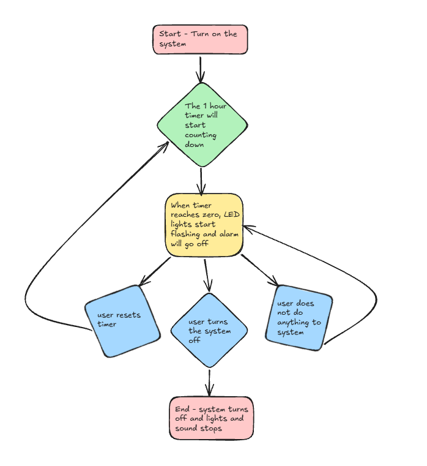

# Project Documentation

## Requirements Outline:

### Defining the Purpose:
**The Need**- People spend a lot of time looking at their devices for too long without taking sufficient breaks. This way their eyes get harmed and also their body is not engaging in any sorts of physical activities and it could lead to long-term consequences for that person. They need some sort of robot or device telling them when to take a break.

**Proposed Solutions** - I will design a robot that makes a noise and starts flashing colours every hour so that people will be notified when to take a break from their screens so that they will stay healthy. This device will only work when it is turned on/connected to a power source so that it will not act as an alarm when it is not needed. It will flash a bright colour every hour after it is turned on and it will play an alarming noise and the only way it will stop is if the person gets up and turns it off.

### Identify Key Actions:
- Starts counting time the very second it gets plugged in or turned on to a power source, making sure it doesn't randomly go off when it's not needed
- Triggers the alarm every hour on the dot by flashing bright warning colours and blasting an annoying noise to force you to look away from your screen
- Forces you to physically get up out of your chair to manually flip the switch or turn it off, which guarantees you are actually moving your body and taking a proper break
- Keeps your eyes and body healthy by repeating this loop every single hour, stopping you from getting long-term health problems from zero activity

### Functional Requirements:
**Power Input** - If the device is plugged into a USB port or a wall power adapter, the microcontroller must immediately boot up, launch its internal clock code, and begin a 60-minute countdown loop in the background while keeping all LEDs and buzzers turned off so it doesn't disturb you while you work.

**Time Tracker** - The microcontroller must continuously calculate the total time elapsed since it was turned on, updating a counter in its memory every second so that it can save or display the exact number of hours and minutes you have spent looking at your device.

### Test Cases:
| Test Case | Input     | Expected Output   |
|---------- |---------- |----------------   |
|Screentime too long after turned on           |The 1 hour timer goes off          |The lights start blinking and alarm goes off                   |
|Screentime is adequate after turned on           |1 hour timer is counting down           |The system does not do anything                   |
|Product is not on           |There is no input           |There is no output                   |

### Non-Functional Requirements:
**Efficiency** - The system must be able to work as soon as it is turned on and must be able to countdown properly. The LED's must be able to work properly and the user must also take responsibility to use the product for what it is meant for, only then the product will be able to reach maximum efficiency.

**Response Time** - The LED's and microbit should activate to project light and sound within a one second. This way, the product will be can work like it is supposed to and the lights and sounds will activate every hour.

**Accuracy** - The product must be accurate in terms of timing so that the light and sound will activate at the correct time and the product will do what it is meant to do.

## Algorithms:
### Flowchart:

### Pseudocode:
kajsbfouiadalkjd