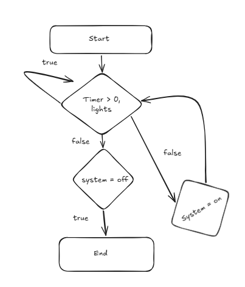
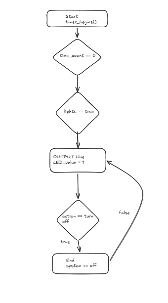
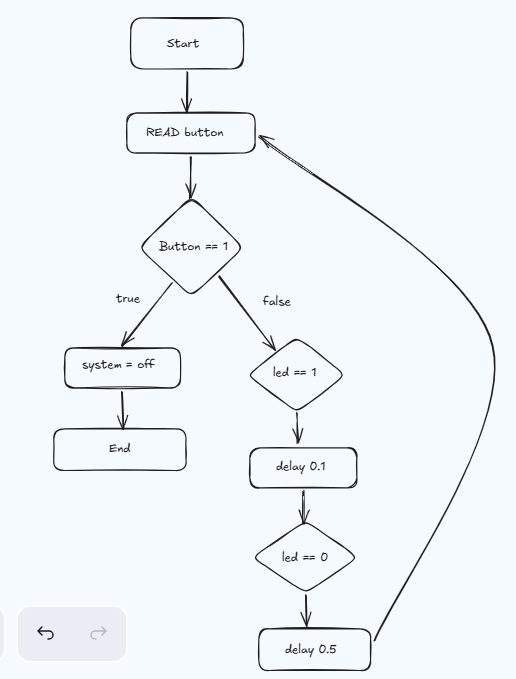
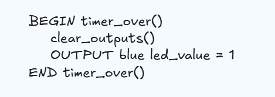
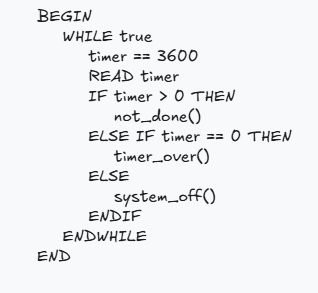
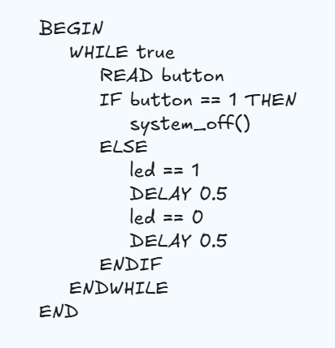
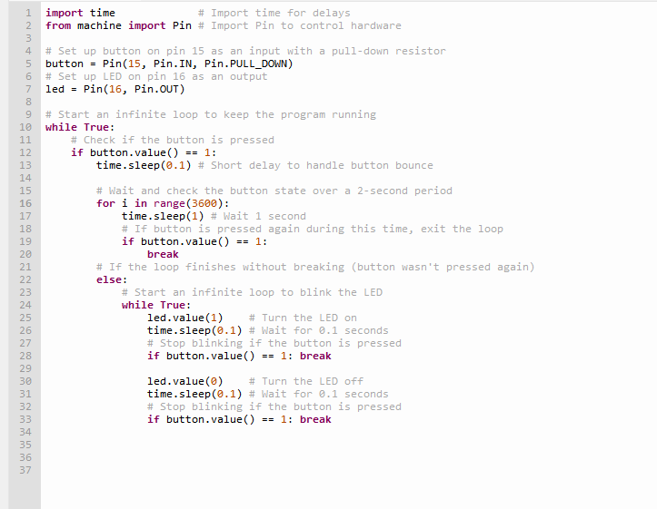
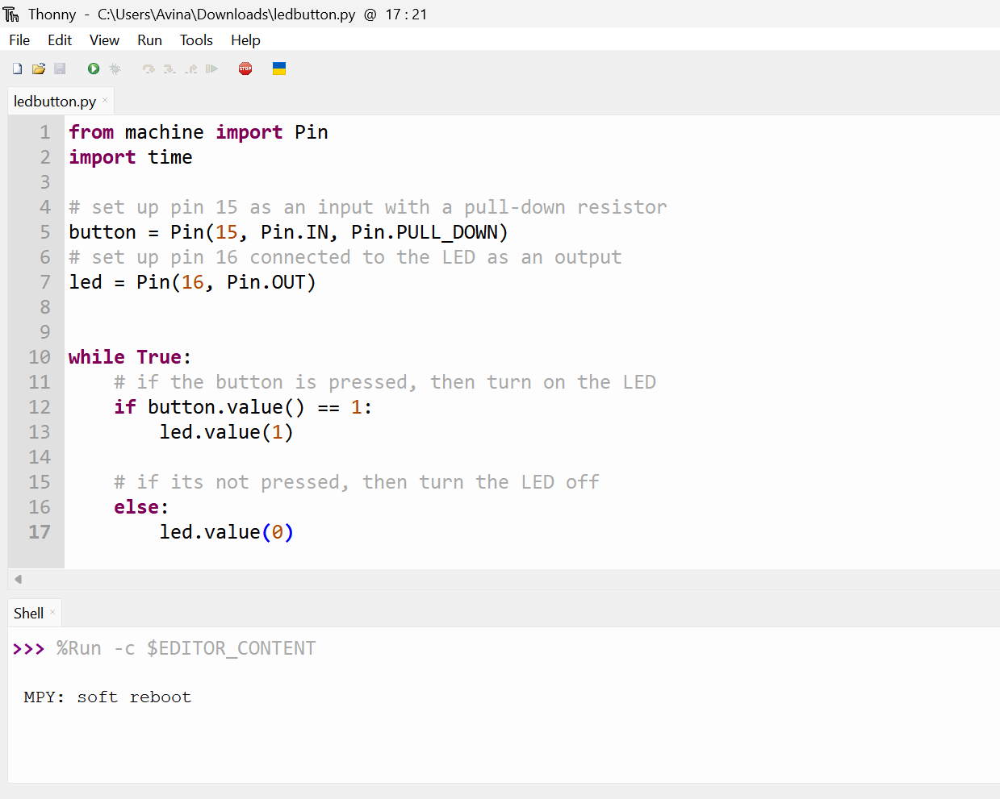
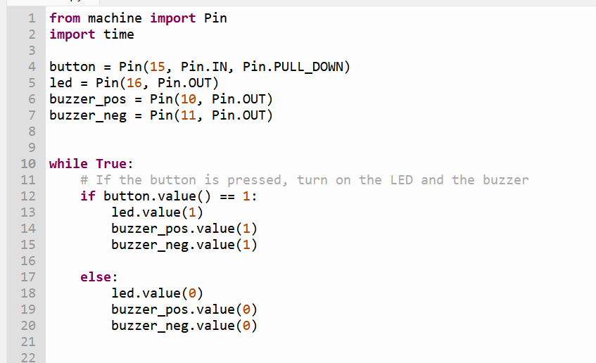

# Project Documentation

## Requirements Outline

### Defining the Purpose:
**The Need**- People spend a lot of time looking at their devices for too long without taking sufficient breaks. This way their eyes get harmed and also their body is not engaging in any sorts of physical activities and it could lead to long-term consequences. People need a robot or device reminding them when to take a break.

**Proposed Solutions** - I will design a robot that starts flashing a colour every hour so that people will be notified when to take a break from their screens so that they will stay healthy. This device will only work when it is turned on/connected to a power source so that it will not act as a distraction when it is not needed. It will flash bright blue every hour after it is turned on and the only way it will stop is if the person gets up and turns it off or restarts it.

### Identify Key Actions:
- Starts counting time the very second it gets plugged in or turned on to a power source, making sure it doesn't randomly go off when it's not needed
- Flashes a bright warning colour to force you to look away from your screen
- Forces you to physically get up out of your chair to either restart it or turn it off, which guarantees you are actually moving your body and taking a proper break
- Keeps your eyes and body healthy by repeating this loop every single hour, stopping you from getting long-term health problems from zero activity

### Functional Requirements:
**Power Input** - When the button is turned on, the Raspberry Pico Pi must immediately activate, and begin a 60-minute countdown loop in the background while keeping the LED turned off so it doesn't disturb you.

**Time Tracker** - The system must continuously calculate the total time elapsed since it was turned on, so that it knows when to start flashing the LED.

### Test Cases:
| Test Case | Input     | Expected Output   |
|---------- |---------- |----------------   |
|Screentime too long after turned on           |The 1 hour timer goes off          |The light starts blinking                   |
|Screentime is adequate after turned on           |1 hour timer is counting down           |The system does not do anything                   |
|Product is not on           |There is no input           |There is no output                   |

### Non-Functional Requirements:
**Efficiency** - The system must be able to work as soon as it is turned on and must be able to countdown properly. The LED must be able to work properly and the user must also take responsibility to use the product for what it is meant for, only then the product will be able to reach maximum efficiency.

**Response Time** - The LED and Raspberry Pi Pico should activate to project light within one second after the timer is over. This way, the product can work like it is supposed to and the light will activate every hour.

**Accuracy** - The product must be accurate in terms of timing so that the light will activate at the correct time and the product will do what it is meant to do.

## Algorithms

### Flowchart 1:

### Flowchart 2:

### Flowchart 3:

### Pseudocode 1:

### Pseudocode 2:

### Pseudocode 3:

## Development and Integration

### Final Code (after I changed my idea a bit)
For my circuit to work and not overcomplicate it, I had to remove the alarm aspect of my machine and change my Requirements Outline, circuit setup, flowcharts, pseudocodes and main code for it to fit my new idea.

## Testing and Debugging

### Test Cases:
| Test Case | Input     | Expected Output   |
|---------- |---------- |----------------   |
|Screentime too long after turned on           |The 1 hour timer goes off          |The light starts blinking                   |
|Screentime is adequate after turned on           |1 hour timer is counting down           |The system does not do anything                   |
|Product is not on           |There is no input           |There is no output                   |

For this test case, I do not need to make much improvements, as it aligns with my system and the code well. This is because I had to simplify my test case a little, to match the rest of my project. So the improvements I made were directed towards the Test Case itself rather than the code, circuit, etc.

### Product Video
There is a recording in the folder to watch. This is the video of my product working. In this video I set the timer to three seconds because one whole hour would be too long to record. But in the code and the real product for the assessment, the timer will be set to one hour.

### First code draft:

### Second code draft:

### Final code:

### Evaluate Process:

In the original test case, I had included a buzzer to alarm the users to take a break from their screens. But eventually, I realised that the concept of buzzer was unnecessary, so instead of overcomplicating , I kept it simple and easy to use. To fix errors, I analysed my code to see whether the LED values, pin values and everything was all correct. When I found an error I tried fixing it and if it didn't work, I repeated the process. The LED component went really well, because the circuit is easy to assemble and code was well written. What really challenged me through this process was my initial idea to include the piezzo buzzer to make an alarming noise to notify the users. After I realised that it is an unnessaery step, I decided to drop this aspect and keep my project simple. Based on the test results, I think my system can include more functionality to make it comprehensive. I could have improved the machine to be a little more interesting by adding functionality like snooze etcs.    

## Evaluation

### PMI Table - Rachael
| Plus | Minus     | Interesting   |
|---------- |---------- |----------------   |
|Circuitry works practically, and fulfills the functional and non-functional requirements well. There are no delays with the LED and button working perfectly with no issue. Code works efficiently and does not output any errors to the user or the raspberry pi pico. The benefit of this solution is the annoyance of a bright light while distracted on your device.|||

### PMI Table - Sarah
| Plus | Minus     | Interesting   |
|---------- |---------- |----------------   |
| The final product addresses the need, and meets the need and requirements well. The blue led flashes at the required time and the button works perfectly well. The code is short and efficient and functions the program perfectly. |The program and wiring worked perfectly fine but the product is quite simple. The need states that the program will alert the user to take a break when the LED flashes but the user might not notice. Avina could implement a buzzer to alarm the person so they can notice it easier.        | The program was interesting because it is interactive and unique. The button is fun to press.            |

### Final Evaluation Questions (SEEL)
**Evaluate your Final Test in Relation to Functional Criteria:**
My project meets all the functional requirements that I set at the start. For example, when it turns on, the timer starts a countdown and flashes the LED exactly when the time is up, plus the button restarts the timer and unplugging it turns everything off. This shows that all the electronic parts and code are working properly. Overall, it proves that is it a functional system that carries out its main purpose.

**Evaluate your Final Test in Relation to Non-Functional Criteria:**
In terms of efficiency, my proect meets all the criteria and works exactly the way it is meant to. For example, the timer always counts down without any glitches and the LED flashes within one second of the countdown finishing. This proves that the system processes information quickly and performs it without any delays or bugs. Overall, because the timing and flashing are perfectly accurate, it shows that the system is highly efficient that completes its main task successfully.

**Evaluate your Final Performance in Relation to the Identified Need:**
My final project successfully solves the problem of people staring at screens for too long without taking breaks. For example, my device tracks screen time with a countdown timer, flashes and LED when it is time to stop and resets with a button. This shows that the system gives users a clear reminder to get some physical activity and protects their eyes. Overall, because the device works perfectly to stop unhealthy screen habits, it fully meets the need.

**Evaluate your Project in Relation to Project Management:**
I feel that I could have managed my project a little better in terms of time. For example, I only started the testing and debugging section three days before the due date, and I still had earlier parts of the project to finish. This shows that my time management was a bit rushed at the end and left me with stress before the deadline. Overall, even though it was stressful, I was still able to finish the prototype and meet all the assessment's requirements successfully.

**Evaluate your Project in Relation to Peer Feedback:**

**Justify Future Improvements you could make to your Final Product:**
An improvement I would make to my final product is to upgrade the hardware so the system is more interesting and interactive. For example, I could add multiple blinking LEDs or a buzzer that alerts the user when the countdown finishes. This change would make the project much better as it triggers more than one sense and grabs the user's attention much better. Overall, while my product functions exactly as planned, these additions would make it much more engaging and effective for everyday use.